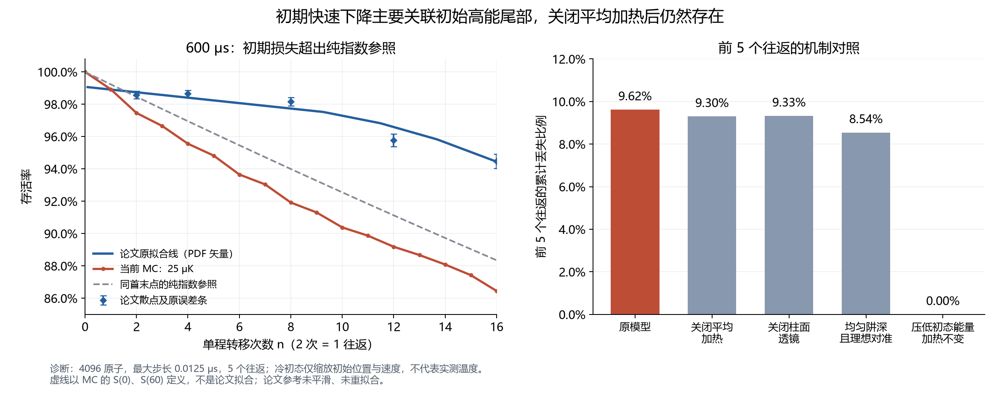

# 手工 600 μs 初期存活率诊断

2026-09-15。当前展示条件 T = Tref = 25 μK；Fig. 6 短转移协议，无长距离运输。

## 结论

初始高能尾部在转移过程中优先丢失，是当前模型初期快速下降的主要证据指向；初始采样与实际格点阱深不一致还引入了本不应计入初始存活池的原子。不能把初期快速下降主要归因于平均噪声加热或柱面透镜。

这不是对实验真实温度或真实损失机制的测量。本轮未修改生产模型、既有参考数据或 PPT。

## 指数下降的判断

纯指数 S(n)=S(0)p^n 在普通坐标中本来就前陡后缓；其特征是条件损失比例不随次数变化，而不是每次减少同样数量。两种单程操作的检查点不同，因此这里按完整往返比较。

| 往返区间 | 几何等效每往返条件损失 |
|---|---:|
| 第 1–1 往返 | 2.539% |
| 第 2–5 往返 | 1.868% |
| 第 6–10 往返 | 1.394% |
| 第 11–20 往返 | 1.450% |
| 第 21–30 往返 | 1.461% |

MC 的 S(2)=97.4609%、S(10)=90.3809%、S(60)=62.8418%。以相同首末点构造纯指数参照 S_exp(n)=S_MC(60)^(n/60)，其 S_exp(10)=92.5496%，比 MC 高约 2.17 个百分点。第 10–60 次单程的 log(S) 线性描述约为 S(n)=0.97451×0.992745^n，仅作形状诊断，不作为独立实验拟合或修正曲线。

论文 Methods 采用 S_n=p0·p^n·[1-exp(-1/(b·n))]（n>0），本身也不是纯指数；作者将指数分量可能归于实验不完善。当前读取的论文原拟合线在 n=10 约为 97.2901%，并非该位置的独立测量点。

## 配对短程对照

使用同一 4096 原子的归档初态、同一格点参数与逐程抖动序列，重跑前 5 个往返。基线逐原子存活状态与归档前缀完全一致。最大步长 0.0125 μs。

| 改动 | 第 10 次单程存活率 | 已丢失原子 |
|---|---:|---:|
| 原模型 | 90.3809% | 394 / 4096 |
| 关闭平均加热 | 90.6982% | 381 / 4096 |
| 关闭柱面透镜 | 90.6738% | 382 / 4096 |
| 均匀阱深且理想对准 | 91.4551% | 350 / 4096 |
| 压低初态能量加热不变 | 100.0000% | 0 / 4096 |

关闭平均加热：保留位点差异、逐程抖动和运动势阱。关闭透镜：其余输入不变。均匀格点诊断同时去掉阱深/束腰散布、静态对准和抖动，不能进一步拆分各项贡献。冷初态诊断仅将初始位置、速度各乘 sqrt(5/25)，保留原有 Tref=25 μK 的加热；它不是精确有限阱深平衡分布，也不是实验温度标定。

关闭平均加热和透镜的 S(10) 变化分别为 +0.317、+0.293 个百分点，配对标准误分别约 0.356、0.377 个百分点；这种小差异不足以确认对应改善，但足以看到关闭它们后快速下降仍然存在。机制之间存在相互作用，不能将存活率差直接解释为可相加的损失份额。

## 初态证据与初始化问题

前 10 次单程丢失的 394 个原子，其平均初始激发能 E/kB≈113.65 μK；同期幸存者约 56.58 μK。这里是相对各自 SLM 阱底的能量单位，不是温度。初始激发能小于 40 μK 的 1097 个原子在前 10 次没有损失；大于等于 100 μK 的 520 个原子中约 59.6% 丢失。

代码先按名义 140 μK SLM 阱采样并拒绝 E≥0 的提议，然后独立抽取实际格点深度；引擎却无条件把初始 alive 设为 True。重新按实际格点计算，50/4096=1.2207% 的原子初始 E≥0，其中 42 个在第一个往返被判丢失，50 个均在前 10 次单程内被判丢失。

仅在归档中排除这 50 个初始不束缚原子，并以剩余 4046 个作为分母：第一往返损失由 2.5391% 降为约 1.5324%；第 10 次单程存活率由 90.3809% 升为约 91.4978%，仍明显低于论文原拟合约 97.29%。这只是条件化重统计，不是重新生成正确初态后的模拟。

合理的初始化修正是先确定实际格点势阱，再按对应势阱准备与筛选初态，并明确 S(0) 的实验归一化。修正初始化并不能单独补齐与论文的约 6.91 个百分点初期偏差；高能分布、转移激发及后续加热仍须分别约束。降低温度可以移除初期损失，但现有扫描已显示其可能让后期损失不足，不能据此直接选温度来强制匹配。

## 追溯

- [逐原子统计与对照结果](diagnostics.json)
- [诊断脚本](../../diagnose_manual600_early.py)
- 原始归档：`simulation\level2_joint_transfer\outputs\continuous_level2c_345\run_20260914\precision_T25_matched_manual_600us_N4096_dt0.0125.npz`
- NPZ SHA-256：`b36072b354f7240cad79f5f846ccbdccc7c247dff2e1e9291466a1ef1439738c`
- 初始化：`src/continuous_transfer/cli.py` 的 `case_inputs`；`src/level3_3d_transport_lensing/thermal_sampling_3d.py`。
- 存活初始化与检查点：`src/continuous_transfer/engine.py` 的 `integrate`。
- 论文：根目录 `2403.12021v4.md` Methods，Fig. 6 段落。

