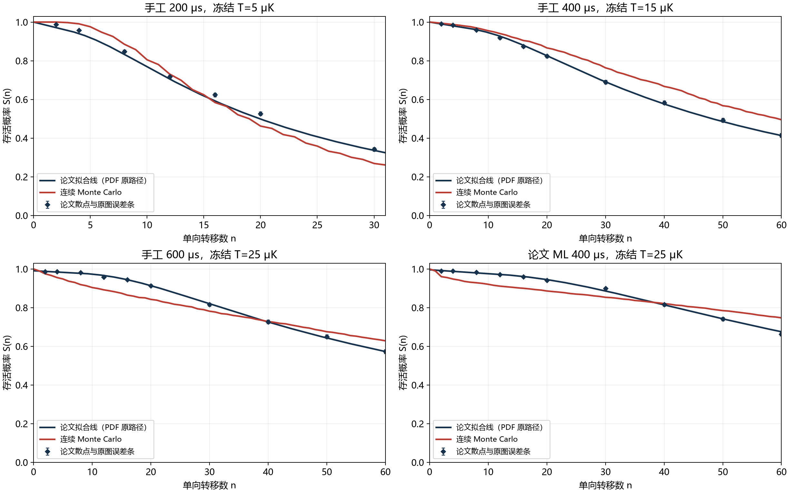

# 论文参考数据更正与重新对照

2026-09-15。适用于独立 Level 5 PPT 的参考数据修正版。

旧程序按颜色逐列追踪图像，把拟合线、菱形标记和遮挡边缘混在一起，造成锯齿及局部偏移。当前版本直接读取论文 PDF 第 7 页的独立矢量对象，不对旧结果做平滑，也不依据模拟结果修改论文曲线。

## 图中三类内容

- 论文拟合线：直接保留 PDF 中的折线路径与原始坐标。
- 论文散点：只显示实际测量位置的 37 个标记中心，分别保留其原图误差条。误差条的几何范围不自行解释为某种置信水平。
- 连续仿真：沿用归档结果，未重新抽样，未重选各波形的温度。

数字化拟合线采样不是独立实验点。拟合线也不必穿过每个实验散点。例如 ML 在 n=60 处的拟合值约 0.6753，而散点约 0.6634，两者分别保存、分别比较。

## 冻结参数的高精度结果

| 波形 | 冻结 T / μK | 末点 n | 论文拟合 S | 仿真 S | 对拟合线最大偏差 | 对实际散点最大偏差 |
|---|---:|---:|---:|---:|---:|---:|
| 手工 200 μs | 5 | 31 | 0.3243 | 0.2610 | 6.78 个百分点 | 7.36 个百分点 |
| 手工 400 μs | 15 | 60 | 0.4132 | 0.4949 | 9.76 个百分点 | 8.39 个百分点 |
| 手工 600 μs | 25 | 60 | 0.5731 | 0.6284 | 7.98 个百分点 | 8.02 个百分点 |
| ML 400 μs | 25 | 60 | 0.6753 | 0.7471 | 7.18 个百分点 | 8.37 个百分点 |

拟合线对比保持旧区间：200 μs 使用 n=5..31，其余使用 n=5..60。散点对比只在论文实际位置上进行，200 μs 为 n=2、4、8、12、16、20、30，其余再增加 40、50、60。两列偏差的比较位置不相同。

四条冻结参数结果均未通过保留的 ±0.02 比较容差。该容差与论文误差条分别处理，也不代表当前矢量读取的不确定度。独立 4096 样本的逐点 95% 区间在每条曲线上仍存在完全处于拟合线容差带外的点。不能将这些逐点区间解释成整条曲线的同时置信带。

全部 184 组结果已重新评估。共同温度扫描的较优格点仍为 T=Tref=15 μK，四曲线等权合并 RMSE 更新为约 0.14646，仍未找到共同通过的格点。

## 数据与结果追溯

新参考在 `simulation/level2_joint_transfer/reference/fig6d_vector_v2/`。其 JSON 保存 PDF SHA-256、图形对象索引、拟合路径、散点、误差条和轴标定。主配置已经指向新拟合线参考。历史扫描配置与归档数据保留，以便复现当时的结果。

本目录 `Level5_vector_reference_v2.evidence.json` 保存当前报告证据，`Level5_vector_reference_v2.recomparison.json` 保存全部 184 组的重新对照值。旧报告和旧参考均未覆盖。
