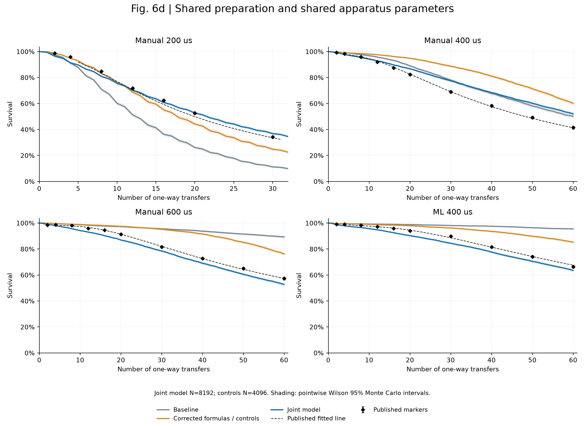

# Fig. 6d 物理诊断、共同模型修正与联合标定

当前目标分支为 `movement_effects_v1`，开始工作时通过 GitHub 官方API和实际git fetch核实最新提交仍为 **c4775da561be0bf746448c52c5d2a5228937fbdd**。保留旧审计目录和所有历史参考数据，未更改论文散点、归一化或评价区间。本目录共保存146组完整四曲线计算，详见 `scan_history.csv`。源码精确版本以 `source_manifest.json`、逐运行源文件哈希和源码归档为准。

修正后的生产源码提交为 `b830ffffc764789c209ce04566c2c9ceb851f175`（本地提交，未推送远端）。研究入口、配置、队列和报告也纳入最终源码归档。

**结论：共同模型显著改善了失配，但尚不能把四条曲线全部解释到实验误差或±2个百分点。** 最终结果是已探索物理工作域中的共同参数模型，不能当作装置参数已被唯一测定，也不宣称找到全局最优或实验损失机制已被证实。旧基线的200 us损失偏大与长时曲线损失不足确实同时存在；它们对应机械操作与随机能量演化两个不同问题，统一放大固定功率不足以解决。

## 最终实际共同模型

四组共同 `T0=19 uK`，SLM/AOD标称共同腰 `1.11 um`，AOD单边RIN `5.75e-09 /Hz`；SLM在短时操作窗口采用安静近似。`Tref`从最终扩散模型中删除。透镜情景 `vs=0`（0表示关闭透镜的短途近似，不表示真实声速为零）。原50 nm静态偏差、10 nm段间抖动、2% AOD静态散布没有参与拟合。四组仅保留实验操作时长与波形的差异。

完整四列参数、单位、来源、范围依据、调整理由和退化关系见 [PARAMETERS.md](PARAMETERS.md) 与 [parameters_before_after.csv](parameters_before_after.csv)。实际调用链与配置覆盖顺序见 [CONFIGURATION.md](CONFIGURATION.md)。温度和PSD范围来自明确披露的模型工作域，**不是实验测量的置信区间**。共同腰位于测量允许区间内，但AOD等腰仍依赖入瞳匹配假设。最终腰已触及1.11 um边界，不能据此进一步放宽范围或称其为精确测量。

## 三阶段定量对比

评价使用原图37个实验散点：200 us共7点，其余每条10点。每条先平均点误差，再对四条等权平均；这个规则在选参前冻结。早期固定n<=20，后期n>20。下表残差为模拟减实验，正号表示存活率过高。

| 曲线 | 基线RMSE/pp | 确认修正后/pp | 最终独立验证/pp | 最终早期偏差/pp | 最终后期偏差/pp | 最终最大散点偏差/pp |
| --- | --- | --- | --- | --- | --- | --- |
| Manual 200 us | 19.11 | 5.72 | 2.76 | -2.33 | +2.57 | 4.47 |
| Manual 400 us | 6.43 | 14.17 | 6.54 | +0.98 | +9.99 | 10.87 |
| Manual 600 us | 15.54 | 11.66 | 3.44 | -2.42 | -3.98 | 4.65 |
| ML 400 us | 13.06 | 9.00 | 3.19 | -2.11 | -3.96 | 5.46 |


联合RMSE：14.31 pp → 10.61 pp → 4.26 pp（基线→确认问题修正→独立验证）。确认修正阶段仍保留固定功率作为逐项对照，不能把它当作最终完整噪声模型。该阶段修正PSD系数、手工波形和ML控制点来源，保持T0=Tref=15 uK。

必须单独指出：**400 us没有实现整体改善**（RMSE约6.43→6.54 pp，差异本身不应过度解读）；其早期平均偏差下降，但后期仍高估存活约10 pp。200/600/ML显著改善，不能掩盖这一点。最终200 us早期存活略低、n=30略高；600 us与ML的早晚存活均偏低，说明共同噪声对不同操作的相对响应及初期损失形状仍不完全符合实验。

最终参数在全部验证前锁定，见 [final_lock.json](final_lock.json)。主结果使用两个新种子26091621/26091622，每种子4096原子，合计8192；机械dt=0.0125 us、噪声h=0.05 us。独立验证结果没有反馈用于重选物理参数。基线和确认修正阶段各使用4096原子。误差条仅来自论文图形，置信口径、每点样本量和相关性未明确，故没有构造精确实验似然或统计“通过”。±2 pp只作工程参照。



- [手工200 us](fig6d_manual_200us.png) · [SVG](fig6d_manual_200us.svg)
- [手工400 us](fig6d_manual_400us.png) · [SVG](fig6d_manual_400us.svg)
- [手工600 us](fig6d_manual_600us.png) · [SVG](fig6d_manual_600us.svg)
- [ML400 us](fig6d_ml_400us.png) · [SVG](fig6d_ml_400us.svg)

阴影是逐点Wilson 95% Monte Carlo抽样区间，不含模型误差、时间步误差或真实实验位点相关性。200 us辅助拟合线只到n=31，未外推到60评价；该图横轴限制在32。其余参考拟合线到60。主目标始终是散点，不将密集拟合线视为独立测量。[逐点结果](survival_curves.csv)、[散点残差](point_residuals.csv)、[分曲线指标](metrics.csv)。

## 机制解释与证据强弱

**代码/理论确认。** 单边每Hz PSD下应为Γ=π²ν²S(2ν)、P_x=mω⁴S_x/4，旧系数分别小4倍和2倍。谱定义未改变。旧 `P=ΓkBTref` 是小Γt、单模参考能量的线性化近似；基线整段Γt已不普遍很小，也没有三方向的能量与频率反馈。三维热平衡谐振能量为3kBT，不应把单模kBT误当总能量或再乘错维度因子。

手工图线支持单段 `3s²−2s³`，而旧代码为+J/−J/+J分段S曲线。在15 uK诊断中，单独改回图线支持的函数明显改善200 us，证明这一实现差别足以改变快速操作损失；它同时使慢操作更稳定，反而暴露了后期损失缺失，不能仅靠该修正解释四条实验曲线。

**物理合理但未获装置实验证实。** 新模型对完整时变高斯力施加由PSD推导的随机增量，自动包含能量、方向、深度、阶段与非谐性依赖。平均和方差通过独立谐振子及实际生产核基准；未另加运输加热。原PSD幅值不是测量值，代入新公式直接使用会使长时曲线损失过大。保留同一局部平均漂移、去掉扩散的对照给出不同尾部与存活率，说明平均功率不能代替分布演化；但不证明实验噪声一定是白噪声。

独立静态保持预测排除了“把拟合量级白噪声无条件施加到SLM和AOD两光路”的装置解释：仅SLM强度噪声就使200 ms存活约4.1%，与论文约132 s的无冷却寿命严重不符。更受约束的候选是AOD光路的附加技术噪声、SLM短时近似安静；各光路参数在四组间完全共用。若噪声仅在特定电子操作期间出现，静态寿命约束需要相应重审，当前没有据此再引入自由阶段倍率。

声透镜的vs是有效速度，绝非声速。厂家典型705 m/s和论文SI关系，在填满15 mm孔径、c=7.5条件下给出约0.412425 m/s；该情景与关闭透镜近似都进行了共同参数对照，见扫描记录。未知实际光束填充率使它尚不可唯一确定，不能将旧severity=1值包装为装置标定。

ML位置、深度使用同一时间轴。新的PDF控制点回放对位置图线RMSE约0.000047 um，旧栅格回放约0.00436 um；不夹紧导数、不作额外平滑。旧回放和零速度端点处理另存敏感性对照，均未用于逐曲线补偿。

**剩余猜测。** 非白技术谱、真实AOD束腰/焦平面/非高斯像差、RF功率到阱深的时变标定，以及实际SLM开关边沿可能改变400 us的累积激发。这些目前没有独立证据，未增加自由函数或任意每次技术丢失概率去吸收残差。初态依然是实际位点内的谐振提议拒绝采样，未宣称有限深高斯阱达到严格热平衡。较大样本不能消除这些结构性不确定性。

一个直接的取舍证据是选参池中T=19 uK、腰1.11 um、同N=2048及同seed的RIN对照：从5.75e-9升到6.5e-9/Hz，400 us RMSE由6.86改善至5.39 pp，但600 us由2.71恶化至5.83 pp，ML由3.37恶化至4.37 pp。因此继续统一增大白噪声幅值不能消除目前的相反残差；也不能据此释放400 us独立噪声倍率。这个判断由局部共同参数对照支持，不等于证明所有有物理依据的更完整模型都失败。

特别是n=60，实验400 us与600 us分别约41.8%和57.3%，最终模型却均约52%。这项对操作时长的相对响应是最明确的未解释结构性残差，而不是只缺一个所有曲线共同的温度或加热常数。

详细推导、适用条件和原始文献见 [PHYSICS.md](PHYSICS.md)。每个候选机制的预期可观察结果、实际对照和证据等级见 [MECHANISMS.md](MECHANISMS.md)；[离散初筛图](parameter_screen.png)和[早晚残差原表](diagnostic_residuals.csv)保留未选中的模型。

下面为15 uK、同一seed26091611的机制对照（N见表，初期dt=0.025 us）；系数、手工轨迹、透镜、抖动、扩散均逐项比较。初期较小样本用于辨认较大机制差异，不将百分点以内差异当成显著结论。扩散和平均漂移两行仍是随后被静态寿命排除的“两光路同谱”诊断，不能与最终AOD附加噪声模型混淆。

| 机制对照 | N | 200 RMSE/pp | 400 RMSE/pp | 600 RMSE/pp | ML RMSE/pp | 联合/pp |
| --- | --- | --- | --- | --- | --- | --- |
| baseline_current | 1024 | 19.47 | 6.54 | 15.18 | 12.77 | 14.28 |
| coefficients_only | 256 | 20.68 | 4.43 | 6.18 | 9.33 | 11.96 |
| waveform_only | 256 | 4.25 | 20.23 | 18.15 | 12.59 | 15.13 |
| corrected_both | 256 | 8.63 | 14.66 | 11.89 | 9.33 | 11.38 |
| lensing_off | 256 | 6.39 | 19.54 | 12.46 | 9.30 | 12.89 |
| jitter_off | 256 | 6.04 | 13.40 | 11.94 | 9.57 | 10.61 |
| diffusion_T15 | 256 | 9.97 | 2.49 | 17.90 | 14.25 | 12.54 |
| local_mean_T15 | 256 | 9.38 | 6.67 | 10.47 | 4.26 | 8.07 |


## 能量演化、条件损失与记录时点

[条件损失图](conditional_loss.png)与[逐次CSV](conditional_loss.csv)显示奇偶交接差异；图中不同实验间隔转换为每单程等效几何损失率，不冒充实测逐单次危险率。[能量演化图](energy_evolution.png)与[CSV](energy_evolution.csv)比较每个完整往返回到SLM的幸存者分布；高能原子优先丢失会改变剩余分布，所以幸存者平均能量的下降不表示发生冷却。

| 曲线 | 等待末记录损失 | 等待开始已正能 | 其中占比 | 放下末记录损失 | 平均噪声功/kB(uK) |
| --- | --- | --- | --- | --- | --- |
| manual_200us | 2365 | 2333 | 98.6% | 4583 | 15.35 |
| manual_400us | 1669 | 1660 | 99.5% | 2263 | 44.95 |
| manual_600us | 1670 | 1668 | 99.9% | 2207 | 65.84 |
| ml_400us | 1409 | 1400 | 99.4% | 1583 | 45.68 |


最后一列是每个原始原子在失去束缚前累计的平均随机噪声功，不能当成三维温升。等待末记录的损失中，已有一部分在拾取结束、关闭SLM后就为正能；因此绝不能用pickup分类为零证明拾取没有激发。新数组保存分段末能量与切换功，而位置和速度连续。

实际比例为约98.6%–99.9%：绝大多数等待末记录的损失在等待开始时已经正能。相同AOD谱产生的平均累计噪声功却分别约15.3/45.0/65.8/45.7 kB·uK，差异自然来自波形、暴露时间、局部力及提前损失；没有逐曲线加热倍率。

在T=18 uK、RIN=7e-9/Hz、腰1.17 um的1024原子对照中，允许正能原子继续传播并可能再捕获，四组S60分别变化0.098 / 0.293 / 0.098 / 0.293 pp，说明此观测近似在所测条件下不是主要残差来源；这不是对所有参数的严格定理。最终仍沿用统一E=0束缚边界，未调整阈值。[观测对照](observation_comparison.json)。

## 数值验证与可辨识性

| 曲线 | dt变化/us | 最大S差/pp | 该点配对SE/pp | 末点个体标签不一致 |
| --- | --- | --- | --- | --- |
| manual_200us | 0.0125→0.00625 | 1.147 | 0.545 | 9.55% |
| manual_400us | 0.0125→0.00625 | 1.538 | 0.809 | 26.83% |
| manual_600us | 0.0125→0.00625 | 2.124 | 0.792 | 32.20% |
| ml_400us | 0.0125→0.00625 | 0.684 | 0.827 | 28.25% |
| manual_600us | 0.00625→0.003125 | 0.977 | 0.771 | 30.74% |


上表数值收敛比较覆盖0–60全部检查点；这不是对200 us论文拟合线作区间外评价。
600 us第一次减半的最大差约2.1 pp，因此追加dt=0.003125 us的针对性复核，保持同一初态与噪声增量；这个检查没有用于重选温度、PSD、束腰或主报告步长。

追加复核的最大差降到0.98 pp。噪声h=0.05→0.025 us的四曲线最大分布差为约1.12/1.05/1.44/0.71 pp，末点差均不超过0.37 pp。两个新种子的合并联合RMSE为4.26 pp，按原子重抽样的95% MC区间约4.05–4.51 pp；该区间完全不包括装置参数和实验不确定性。数值验证支持总体趋势与主要残差的判断，**不支持逐原子逃逸轨迹已收敛或亚百分点数值精度**。

机械dt减半时保持同一个噪声h和每原子随机序列。存活率接近不表示个体逃逸轨迹已严格收敛，末点标签不一致比例如上；较大的个体差异应作为混沌逃逸边界的数值敏感性报告。另有新种子的噪声h减半、两独立种子差异、保留时间相关性的MC重抽样以及逐项消融，数值表和解释见 [VALIDATION.md](VALIDATION.md)；不按哪一步长更贴实验选步长。MC区间针对独立模拟噪声实现，不能替代真实实验同光路原子间共享噪声的误差模型。

`noise_benchmarks.json`的参量/指向平均增长与能量方差在三档步长均符合推导；`gaussian_benchmark.json`进一步验证实际全高斯力核的径向/轴向增长率和注能账本。`tests_rng.xml`验证噪声在不同线程数下可重复。原实际位点束缚初始化和连续传播测试均通过。整套非slow回归245项直接通过，另两项安装环境问题在独立venv中修复后通过；新物理/线程检查另外验证。未对本轮无关的10项slow测试宣称执行。

以下较大样本候选显示温度、RIN与共同束腰的退化，差异不能作为精确参数置信区间。选择依据是固定共同目标；没有四条曲线分别选温再拼接。

| 候选 | N | T/uK | AOD RIN/Hz^-1 | 腰/um | vs/m s^-1 | 联合RMSE/pp |
| --- | --- | --- | --- | --- | --- | --- |
| refine3_T18_R6.5e-09_W1.11 | 1024 | 18 | 6.5e-09 | 1.11 | 0 | 3.996 |
| selection_T19_R5.75e-09 | 2048 | 19 | 5.75e-09 | 1.11 | 0 | 4.208 |
| refinement_seed21 | 4096 | 19 | 5.75e-09 | 1.11 | 0 | 4.278 |
| refine3_T20_R5e-09_W1.11 | 1024 | 20 | 5e-09 | 1.11 | 0 | 4.509 |
| refine0_T18_R7e-09 | 1024 | 18 | 7e-09 | 1.17 | 0 | 4.620 |
| selection_T19_R6.5e-09 | 2048 | 19 | 6.5e-09 | 1.11 | 0 | 4.660 |
| selection_T18_R5.75e-09 | 2048 | 18 | 5.75e-09 | 1.11 | 0 | 4.662 |
| selection_T18_R6.5e-09 | 2048 | 18 | 6.5e-09 | 1.11 | 0 | 4.706 |
| refine3_T17_R7.5e-09_W1.14 | 1024 | 17 | 7.5e-09 | 1.14 | 0 | 4.783 |
| refine3_T18_R6.5e-09_W1.14 | 1024 | 18 | 6.5e-09 | 1.14 | 0 | 4.867 |
| refine3_T16_R8.5e-09_W1.17 | 1024 | 16 | 8.5e-09 | 1.17 | 0 | 4.982 |
| refine3_T20_R5e-09_W1.14 | 1024 | 20 | 5e-09 | 1.14 | 0 | 5.187 |


全部已探索范围：T=4.3–28 uK，RIN=0–1e-8/Hz，共同腰1.11–1.23 um；透镜关闭、旧severity、器件几何情景；原/矢量ML、端点边界、静态误差与抖动、平均漂移/随机扩散、吸收/再捕获均有有限对照。范围边缘和未测噪声谱限制最终解释，不能以有限扫描证明“任何共同模型均不可能”。

## 代码修改与复现

- `noise_heating.py`：修正两个PSD系数与说明，去掉纯音Floquet指数能锁定随机谱系数的错误说法。
- `paper_waveforms.py`、`protocol.py`、`cli.py`：单段三次手工轨迹，保留显式legacy选项；波形与时序不随拟合曲线改变。
- `survival_engine.py`：反向操作保留波形子类，避免新单段三次在drop-off路径被错误退回旧S曲线。
- `noisy_survival.py`：完整高斯力扩散，分光路但全曲线共用谱；分开机械/噪声步长，增加切换功、分段能量与再捕获诊断。
- 本目录 `run_study.py`：显式共同配置、固定散点评分、逐原子NPZ/逐运行完整配置/源码哈希；`waveform_audit.py`从PDF独立读取控制点。

新目录下的历史输出不覆盖。每组 `.npz`含原始alive、状态、能量、实际位点与初态；`.json`含所有实际case参数、底层配置、种子、N、dt/h、源码哈希和指标。参考PDF和参考CSV哈希记录于 `source_manifest.json`。`source_diffusion_v1.zip/v2.zip`保留早期模型，`source_final.zip`冻结最终实现。

当前目录已准备独立venv，下面命令在本机可直接使用。迁移环境时安装 `pip install -e "simulation/level2_joint_transfer[continuous,dev]"` 及 `pdfplumber`，准确版本见 `requirements_exact.txt`；可用脚本的 `-Python` 指定解释器。运行示例：

```powershell
.\reports\movement_effects_v1_calibration_20260916\reproduce.ps1 -Phase final -NewRunDirectory D:\work\fig6d_reproduction_new
.\reports\movement_effects_v1_calibration_20260916\reproduce.ps1 -Phase benchmarks
.\reports\movement_effects_v1_calibration_20260916\reproduce.ps1 -Phase analyze
```

精确队列见 `diagnostic_queue.json`、`scan_queue.json`、`aod_queue.json`、`waist_queue.json`、`lens_queue.json`、`opt3_queue.json`、`refine*_queue.json`、`selection_queue.json`、`final_queue.json`、`validation_checks_queue.json`、`sensitivity_queue.json`。已存在同名同配置结果会复用，要求实际重算时必须用新的 `-NewRunDirectory`。分析当前归档用 `-Phase analyze`。不要直接运行仓库旧默认连续协议并把它当成本报告配置。

## 最需要的独立实验输入

1. 转移前、140 uK SLM中的同一制备温度及能量分布；最好同步做释放再捕获与旁带测温，以区分初温和初态非平衡。
2. AOD和SLM各自原子平面的RIN与指向PSD，覆盖轴向/径向共振及两倍频，同时测两光路相关性；单独AOD静态保持随阱深/时间的损失可直接检验拟合噪声候选。
3. 实际14个ML控制量、AWG时钟/端点约束、RF到位置/深度校准、SLM关断与重开边沿、成像前保持时间。
4. 195个参与位点的AOD腰/深度/焦平面分布与光束在AOD内的直径；该信息可决定透镜情景与400 us剩余机械激发。

这些测量能区分候选机制；继续增加未经约束的拟合自由度不能替代它们。
