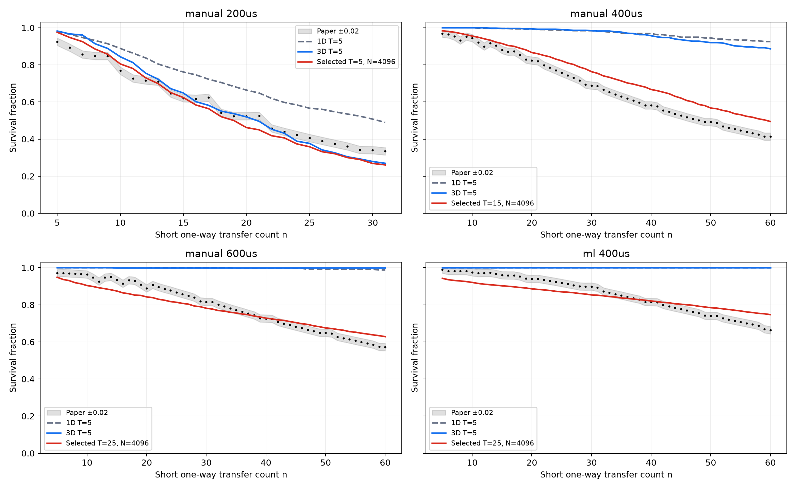

# Level 2C 接入 Level 3/4/5 连续全流程重算

2026-09-14 · v10

**结论：接入三维运动、AOD 柱面透镜、连续往返及有限脉冲后，曲线发生明显变化，但本次扫描与独立复核中，没有找到四条波形同时满足原 Level 2C 全曲线 ±0.02 标准的共同参数。即使分别使用每条波形在扫描池中最接近的参数，4096 个独立样本的整条曲线仍未通过。**

这是否定本次已测试场景的复现结果，不是证明任何参数或任何补充模型都不可能拟合。波形被冻结，未重新优化为其他形状。



## 连续接入了什么

- Level 2C：原手工 200/400/600 μs 波形、论文 Fig. 6c 的原始 15 节点普通三次样条回放、SLM 开关、100 μs 等待、原加热公式和无序幅度。
- Level 3：三维高斯束缚热初态、三维速度 Verlet、crossed-AOD 柱面透镜，随速度移动的两个轴向焦点。
- Level 4 对应的连续流程：每个原子的 r、v 从上一段/上一轮末态接着推进。拾取、等待、放回或附加长运输均使用同一个原子。失阱为吸收事件。
- Level 5：沿同一条实时轨迹取差分光移，连续积累 SU(2) 传播子。有限 XY4 脉冲期间继续机械运动，脉冲起止精确切分积分步。输出无 DD、有限 DD 的条件对比度、相对理想脉冲序列的平均保真度及 PTM。
- 新连续入口是 `continuous_transfer`。原 Level 5 的 Clifford RB、47/195 站点和独立轨迹池仍是另外的实验协议。本次没有把其历史 IRB 拟合冒充连续模型结果。

## 协议、距离与计数

| 项目 | matched：Fig. 6d 对照 | extended：额外长运输 |
| --- | --- | --- |
| 一轮 | 拾取 + 100 μs SLM 关闭等待 + 放回 | 拾取 + 等待 + 375 μm 去程 + 54 μs 保持 + 375 μm 回程 + 放回 |
| SLM | 拾取/放回时开，等待时关 | 长运输及远端保持时也关 |
| 400 μs 波形单轮时长 | 900 μs | 3854 μs |
| 手工单轮名义路程 | 4.8 μm | 754.8 μm |
| n=60 | 30 轮，约 144 μm | 30 轮，约 22.644 mm |
| 验收用途 | 可沿用 Level 2C 参考曲线 | 协议发生变化，只作扩展预测 |

ML 数字化样条保留原始细小反向起伏：单程端点差约 2.400115 μm，积分实际路程约 2.430070 μm。文件中的 `distance_per_round_um` 是端点差对应的往返路程；以上 4.8/754.8 μm 是手工波形与名义协议口径。短拾取沿 x 轴，长运输沿 xy 对角线，总长 375 μm，每轴约 265.17 μm。

## 原 Level 2C 参数下的重算

以下使用独立复核池 512 shots、seed=23002、dt=0.05 μs。手工 200 μs 的论文最后有效点是 n=31，其余使用 n=60。

### T = Tref = 5 μK

| 波形/末点 | 论文 | 1D 新基线 | 3D 透镜关闭 | 3D 透镜开启 | 另加长运输 |
| --- | --- | --- | --- | --- | --- |
| 手工 200 μs / n=31 | 0.3344 | 0.4902 | 0.4668 | 0.2695 | 0.1074 |
| 手工 400 μs / n=60 | 0.4135 | 0.9258 | 0.9531 | 0.8867 | 0.6992 |
| 手工 600 μs / n=60 | 0.5726 | 0.9883 | 0.9980 | 0.9980 | 0.9844 |
| 论文 ML 400 μs / n=60 | 0.6633 | 1.0000 | 1.0000 | 1.0000 | 0.9980 |

### T = Tref = 40 μK

| 波形/末点 | 论文 | 1D 新基线 | 3D 透镜关闭 | 3D 透镜开启 | 另加长运输 |
| --- | --- | --- | --- | --- | --- |
| 手工 200 μs / n=31 | 0.3344 | 0.2324 | 0.0762 | 0.0352 | 0.0078 |
| 手工 400 μs / n=60 | 0.4135 | 0.4922 | 0.2598 | 0.1602 | 0.0957 |
| 手工 600 μs / n=60 | 0.5726 | 0.7031 | 0.3848 | 0.3555 | 0.1953 |
| 论文 ML 400 μs / n=60 | 0.6633 | 0.8027 | 0.5117 | 0.5117 | 0.3105 |

1D 新基线也重新抽取逐段抖动：随机流按原始 shot ID 分配，避免不同波形发生损失后改变后续随机样本对应关系。其数值不要求与 v8 的旧随机流逐点相同。保持了相同分布与种子约定。三维加热保持总功率，未将其乘以 3。

对准偏移和逐段抖动沿原 Level 2C 的 x 轴施加，未追加未经标定的 y/z 随机扰动。深度、束腰的静态无序则作用于整个三维势。

## 共同参数扫描与冻结后复核

扫描池固定 256 shots、seed=23001。候选 T 为 5、10、15、20、25、30、35、40 μK。按照原 Level 2C 默认行为，Tref 随 T 同时改变；这是一维的耦合参数场景扫描，不能把拟合所得数值称为独立测得的初温。四条曲线等权，目标是各曲线均方误差平均值的平方根。

| T=Tref / μK | 共同 RMSE | 四曲线全部通过 |
| --- | --- | --- |
| 5 | 0.22117 | 否 |
| 10 | 0.18067 | 否 |
| 15 | 0.15045 | 否 |
| 20 | 0.15415 | 否 |
| 25 | 0.17443 | 否 |
| 30 | 0.22182 | 否 |
| 35 | 0.27678 | 否 |
| 40 | 0.29687 | 否 |

共同最优扫描格点是 15 μK。下面给出 4096 shots、全新 seed=23003、dt=0.0125 μs 的冻结后复核；该样本池未参与参数选择。

| 波形 | 共同 T=15 的末点 | 论文末点 | 最大整曲线偏差 | 通过 ±0.02 |
| --- | --- | --- | --- | --- |
| 手工 200 μs | 0.1143 | 0.3344 | 0.2752 | 否 |
| 手工 400 μs | 0.4949 | 0.4135 | 0.0981 | 否 |
| 手工 600 μs | 0.8796 | 0.5726 | 0.3081 | 否 |
| 论文 ML 400 μs | 0.9333 | 0.6633 | 0.2700 | 否 |

如果允许每条波形使用不同的扫描最优参数，结果如下。这仅用于诊断参数矛盾，不能当作同一个实验条件的复现。

| 波形 | 扫描选择 T | 复核末点 | 论文末点 | 最大偏差 / 最差 n | 点在 ±0.02 内的比例 |
| --- | --- | --- | --- | --- | --- |
| 手工 200 μs | 5 | 0.2610 | 0.3344 | 0.0757 / 21 | 18.5% |
| 手工 400 μs | 15 | 0.4949 | 0.4135 | 0.0981 / 39 | 10.7% |
| 手工 600 μs | 25 | 0.6284 | 0.5726 | 0.0773 / 18 | 17.9% |
| 论文 ML 400 μs | 25 | 0.7471 | 0.6633 | 0.0838 / 60 | 17.9% |

原始数字化数据与 v8 固定锚点的单调处理结果均单独保留，未为了通过验收改变参考数据。每条精细复核曲线至少有一个点，其逐点 Wilson 95% 区间完全落在论文 ±0.02 带外。这里没有把逐点区间当作整曲线的同时置信带。

## 步长与 Monte Carlo 不确定性

原 128-shot、0.05→0.025 μs 配对检查的最大曲线变化为 0.1172，超过 0.02。故仅靠原配置的小样本检查不足以宣称严格的 2% 数值精度。

新增精细检查对每个格点使用完全相同的 4096 个初态、静态无序和逐段抖动，比较 0.025 与 0.0125 μs。下表分别列出系综曲线差和最后一个 checkpoint 的逐原子存活标签差；混沌轨迹的标签不一致并不等于系综存活率同幅度变化。

| T | 波形 | 最大 \|ΔS(n)\| | 末态标签不一致比例 | 曲线差≤0.02 |
| --- | --- | --- | --- | --- |
| 5 | manual_200us | 0.0073 | 5.00% | 是 |
| 5 | manual_400us | 0.0073 | 10.08% | 是 |
| 5 | manual_600us | 0.0012 | 0.24% | 是 |
| 5 | ml_400us | 0.0000 | 0.00% | 是 |
| 15 | manual_200us | 0.0046 | 2.08% | 是 |
| 15 | manual_400us | 0.0120 | 22.61% | 是 |
| 15 | manual_600us | 0.0042 | 8.57% | 是 |
| 15 | ml_400us | 0.0049 | 4.86% | 是 |
| 25 | manual_200us | 0.0068 | 1.05% | 是 |
| 25 | manual_400us | 0.0103 | 20.58% | 是 |
| 25 | manual_600us | 0.0129 | 14.97% | 是 |
| 25 | ml_400us | 0.0042 | 13.06% | 是 |

4096 shots 在 S≈0.5 处的单点 95% 区间半宽约 0.0153。模型未通过论文验收的结论，依据整条曲线偏差及更细步长的重复结果，而不是只比较一位小数的末点。

## 有限脉冲与内部态

ηSLM=ηAOD=1.3×10⁻⁴，Ω/2π=24.611 kHz，bare π 脉冲约 20.316 μs。短协议每轮全程对称 XY4；长协议在每个长运输段各放一个 XY4。均未额外延长协议时间。Favg 相对于理想驱动序列计算，且只对当时存活原子取平均。

| 400 μs / 512 shots | S(60) | C 无 DD | C 有限 DD | Favg 有限 DD |
| --- | --- | --- | --- | --- |
| matched, T=5 | 0.8867 | 0.0596 | 0.5459 | 0.6480 |
| extended, T=5 | 0.6992 | 0.0530 | 0.0469 | 0.6784 |
| matched, T=40 | 0.1602 | 0.0540 | 0.4129 | 0.8037 |
| extended, T=40 | 0.0957 | 0.2421 | 0.1424 | 0.7073 |

该模型没有自旋依赖机械力或自发 Raman 丢失，因此无 DD 与 DD 的存活率严格相同。DD 改变相位和相干性，不能通过纯幺正内部态演化补出实验的原子丢失。对比度高也不自动等于相对指定目标门的保真度高。

## 差距的可能来源与证据边界

1. **维度升级改变了可用热能和束缚判据。** 相同的每自由度温度在三维中具有更多运动能量；40 μK 场景发生明显过度损失。不同波形需要不同拟合参数，说明只调共同 T/Tref 不能解决形状差异。
2. **透镜效应对快速波形更敏感。** 200 μs 波形的 5 μK 末点从 3D 无透镜的约 0.467 降至约 0.270，而 600 μs 与论文 ML 基本不丢失，不能产生论文所需的统一衰减。v_s=0.53917 m/s 是旧 Level 3 severity=1 的相对场景，尚非器件独立标定。
3. **长运输增加演化时间和机械激发。** 它可显著降低部分存活率，但 600 μs 与 ML 的低温末点仍接近 1；而且 extended 与 Fig. 6d 的实验协议不同。
4. **原加热模型仍是常数平均功率近似。** 初温与 Tref 耦合、RIN/指向谱及系数约定仍待独立核对。本次刻意保留原公式以隔离维度影响，没有用额外损失项把曲线强行拉到论文上。
5. **波形与装置标定仍有缺项。** 手工位置曲线的具体解析形状、ML 数字化误差、实际 AWG/RF/光强响应和绝对 AOD 透镜参数可能影响结果。本次没有引入未标定的真空、成像、态制备或 Raman 损失。

## 复现与文件

```bash
python -m pip install -e './simulation/level2_joint_transfer[dev,continuous]'
python run_simulation.py run full --stage preflight
python run_simulation.py run full --stage all --output-dir simulation/level2_joint_transfer/outputs/continuous_level2c_345/new_run
```

中间温度扫描、同样本量粗细步长配对及冻结后的 4096-shot 精细确认命令见 `reports/stage_review/README.md`。`continuous_precision.py` 明确锁定扫描选择、seed 和两档步长。

本次读取 184 个实际完成的计算格点，每点保存 JSON 指标和 NPZ 逐原子记录。NPZ 包含所有 61 个 checkpoint 的存活掩码、六维状态、相位及 SU(2) 系数，以及损失阶段、停止时间和实际累计加热。数值源文件与结果 SHA-256 位于 `AOD_SLM_continuous_level2c_345_2026-09-14_v10.evidence.json`。

新增回归覆盖三维力与 Level 3 一致、SU(2) 与 Level 5 一致、一维极限与旧 Level 2C 一致、第二轮从第一轮末态继续、损失吸收与加热停止、DD 无机械反馈、原始 ML 回放及有限脉冲时间边界。
